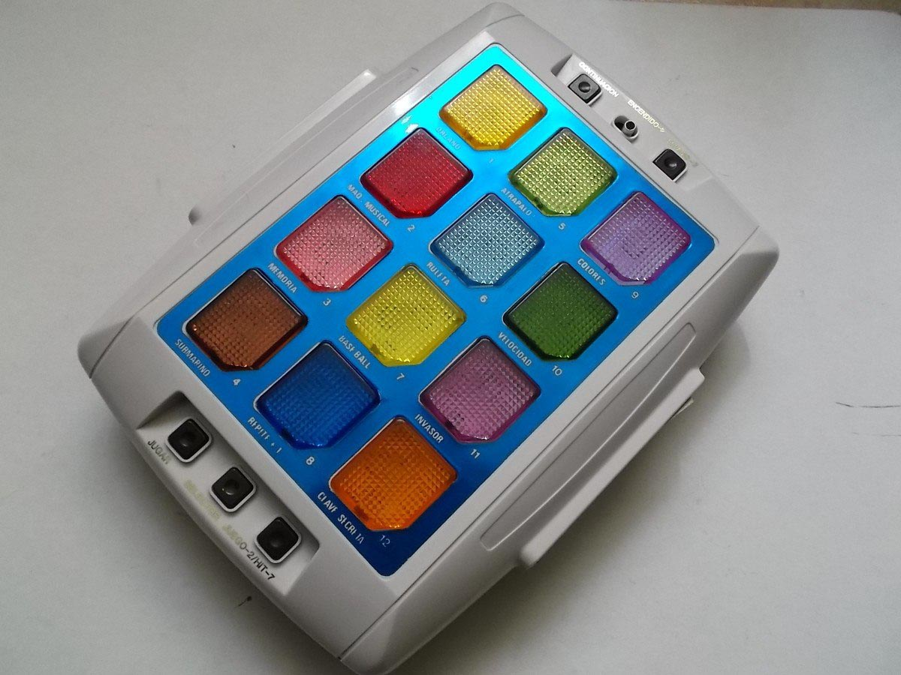
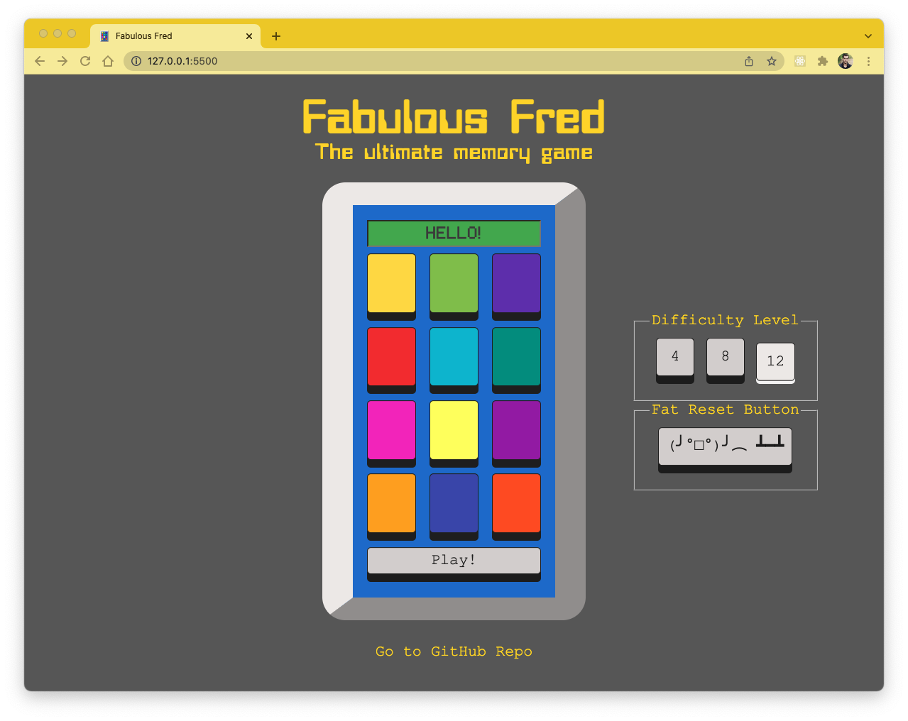
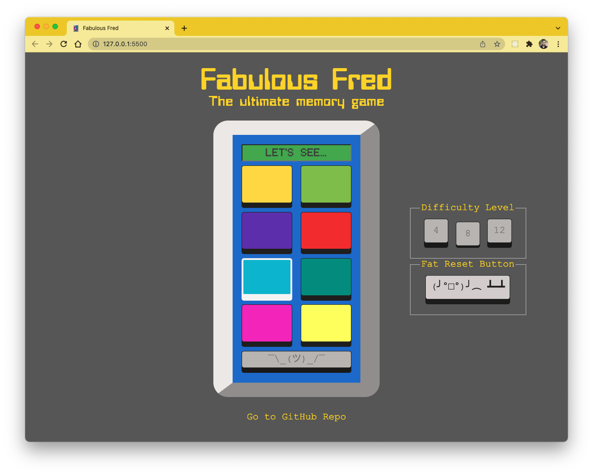
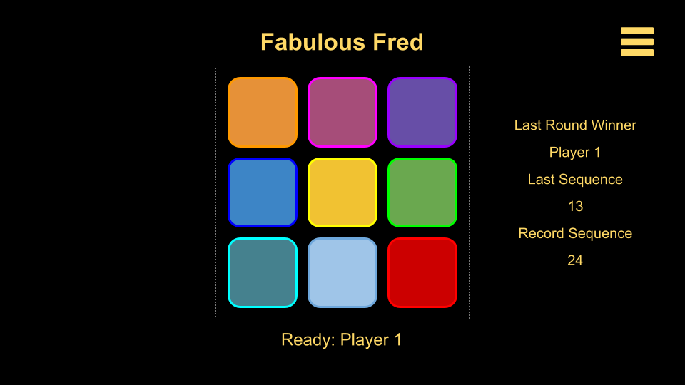
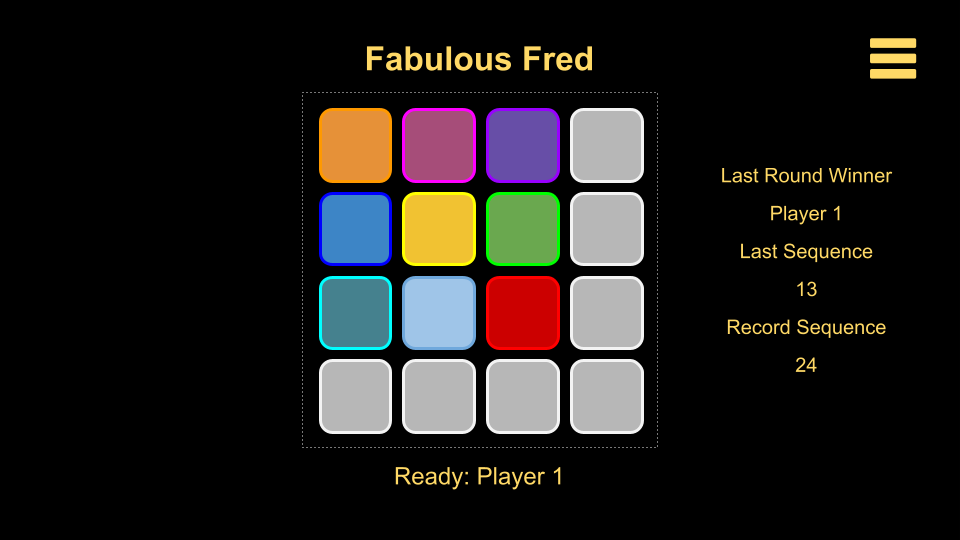

# Fabulous Fred

## About

A memory game inspired by the ultimate electronic game from the 1980s.

The game is played in the same way as Simon Says, where the computer lights up a random sequence of buttons that the user has to repeat by memory. The sequence keeps getting longer until the user presses the wrong button.

### Inspiration

[^source]

### How to play:

- Select a difficulty level, the UI will refresh to show the number of buttons.
- Hit _Play!_, the computer will challenge you with a sequence.
- Repeat the sequence. If you get it right, the computer will repeat the sequence adding one new step.
- If you forget a step, you have 3 chances to cheat. _But beware: the sequence keeps getting longer!_
- If you lose, the computer will flash the key you missed.
- Start over any time by hitting that _Fat Reset Button_!

## Play it [here](https://osadezu.github.io/fabulous-fred/)!

## Game Screenshots

## Technologies Used

- The UI is built purely with HTML and CSS.
- No graphic assets are used other than fonts.
- The program logic is based on pure vanilla JavaScript.
- The sequence animations are delegated to functions with timeouts/intervals.

## Installation

- The game can be played online in ypur browser, no need to install anything!
- Or you can get your own copy:
  - Fork this repopsitory
  - Clone it to your computer
  - Use a local http server like '[Live Server](https://marketplace.visualstudio.com/items?itemName=ritwickdey.LiveServer)' to run it

## Next Steps

- UI updates:
  - Add modal with game instructions.
  - Updated LED screen handler to make messages more dynamic.
  - Relocate LED screen and 'Game Controls' (which are neede during play) to the console, so that the other settings can be hidden during the game.
  - Improve flashing transitions and reactions to make them smoother and more exciting/engaging.
- Game modes:
  - Implement 'insane mode' in which the buttons are reshuffled after every round and the user must memorize colors (nor locations).
  - Implement multiuser mode for 2-4 users to play together against the computer.
  - Implement a play mode in which two users challenge each other.

## Planning

### Wireframes

Game UI for difficulty level: medium (9 buttons)

Game UI for difficulty level: hard (16 buttons, all colors not shown).

### User Stories

- [x] As a user, I want to choose the difficulty level (possible colors in the sequence) so that the game becomes more challenging.
- [x] As a user, I want a dynamic and reactive play experience that keeps me engaged.
- [x] As a user, I want to be able to see the number of colors in the current, to be able to see how far I have progressed.
- [x] As a user, I want to get 'lives' so that I can continue playing an increasingly complex game without losing the first time I make a mistake.
- [x] As a user, I want the game to have a playful/cute personality so that I can 'know' my opponent.
- [x] As a user I want additional complexity in the ways the game is played, so that the game continues to be interesting and exciting.
- [ ] As a user, I want a new mode in which my memory isn't aided by the button's position in the board, so that the game becomes more challenging.
- [ ] As a user, I want to select how many human players will be included, so that I can play with my friends.
- [ ] As a user, I want to be able to play 1:1 against a friend in which we challenge each other instead of playing against the computer.
- [ ] As a user I want the game to display the colors through my smart lighting system so that it becomes more engaging when my friends and I are playing in my living room.

[^source]: http://www.wikimexico.com/articulo/De-ensueno-El-fabuloso-Fred
